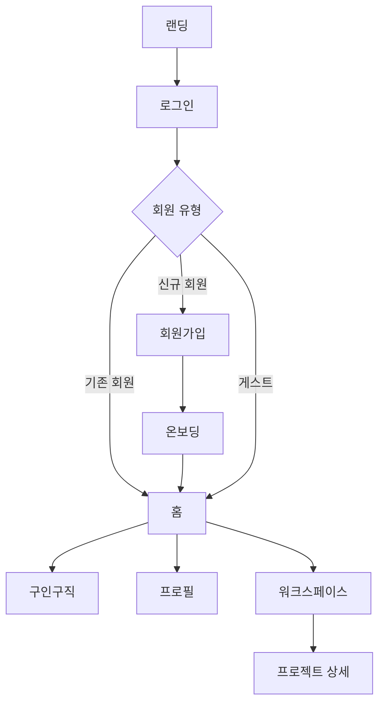

# SLATE-TO FE

> 영상 제작자를 위한 협업 워크스페이스

## 프로젝트 소개

SLATE-TO는 영상 제작자들이 구인구직, 프로젝트 관리, 팀 협업을 한 곳에서 처리할 수 있는 워크스페이스 서비스입니다.

## 팀원 및 역할 분담

| 이름   | 담당 페이지                                             | 담당 공용 컴포넌트                                              |
| ------ | ------------------------------------------------------- | --------------------------------------------------------------- |
| 클레버 | 워크스페이스 · 프로젝트 상세 (영상 피드백) · 설정(계정) | TextArea · YouTube Iframe Player · Select · Choice · ActionMenu |
| 디아   | 로그인 / 인증 (토큰 · 소셜 · 라우팅 가드)               | Input · 영상 미리보기 · Tag · FileInput                         |
| 이브   | 온보딩 · 홈 · 캘린더 · 알림                             | Button · Calendar(라이브러리) · Avatar · DatePicker · Switch    |
| 재희   | 레이아웃 (골격) · 구인구직 · 마이페이지 · 전역 스타일   | ProgressBar · Modal(껍데기+ConfirmModal) · Tabs · 레이아웃      |

> **프로젝트 카드**(디아) · **구인구직 카드**(재희)는 공용이 아닌 **도메인 컴포넌트**로, 화면 조립 단계에서 해당 화면과 함께 구현합니다.

## 기술 스택

| 분류        | 기술                                       |
| ----------- | ------------------------------------------ |
| Framework   | React 19.2.7, TypeScript 6.0.2, Vite 8.1.0 |
| Styling     | Tailwind CSS 4.3.1                         |
| HTTP        | axios                                      |
| API Mock    | MSW 2                                      |
| 상태 관리   | Zustand 5.0.14                             |
| 유효성 검사 | Zod 4.4.3                                  |
| 날짜 처리   | date-fns 4.4.0                             |
| 날짜 선택   | react-day-picker 10                        |
| 코드 품질   | ESLint 10.5.0, Prettier 3.8.4              |
| 배포        | Vercel                                     |

> 버전은 `package.json` 기준이며, 이후 업데이트 시 여기도 함께 갱신합니다.

## 폴더 구조

```
SLATE_TO_FE/
├── .vscode/
├── src/
│   ├── api/              # API 호출 · paths · 응답 정규화(normalize.ts, #93 머지 완료)
│   ├── assets/
│   │   ├── images/
│   │   ├── icons/        # 아이콘 SVG (Flaticon UIcons)
│   │   └── fonts/
│   ├── components/       # 공통 컴포넌트
│   ├── constants/        # 도메인·UI 상수 (카테고리, ActionMenu 액션 enum 등)
│   ├── domains/          # 화면별 도메인 UI (workspace · mypage 등)
│   ├── hooks/            # 커스텀 훅
│   ├── layouts/          # 공통 레이아웃
│   ├── mocks/            # MSW handlers · browser worker
│   ├── pages/            # 라우트 단위 페이지
│   ├── schemas/          # Zod 스키마
│   ├── stores/           # Zustand 스토어
│   ├── styles/           # 공유 Tailwind 클래스 조합 (토큰은 index.css @theme)
│   ├── types/            # 전역 타입
│   └── utils/            # 순수 함수 · 임시 pathname 라우팅
├── .editorconfig
├── .env.example
├── eslint.config.js
├── vite.config.ts
└── tsconfig.json
```

> 라우팅은 React Router가 아니라 `usePathname` + `matchPath` 임시 골격입니다. (`src/utils/navigation.ts`, `App.tsx`)

## 브랜치 전략

```
main        # 배포 브랜치
└── dev     # 통합 브랜치
    └── feature/이름-기능명   # 기능 개발 브랜치 (예: feature/kcleverp-login)
```

- 기능 개발은 `feature/이름-기능명` 브랜치에서 시작
- 문서·설정·버그·리팩토링 등 비기능 작업은 `docs/`·`chore/`·`fix/`·`refactor/` prefix 사용 (예: `docs/kcleverp-readme-convention`)
- `feature` → `dev` PR 후 팀장 코드 리뷰 필수
- dev merge 후 통합 테스트 진행
- `dev` → `main` 은 배포 시점에만 병합
- 모든 변경사항은 GitHub 이슈로 기록

## 네이밍 규칙

| 대상                    | 규칙       | 예시                                    |
| ----------------------- | ---------- | --------------------------------------- |
| 컴포넌트 파일/폴더      | PascalCase | `VideoPlayer.tsx`                       |
| 함수 / 변수 / 커스텀 훅 | camelCase  | `isLoggedIn`, `useAuth.ts`              |
| 레포지토리 / 브랜치     | kebab-case | `slate-to-fe`, `feature/kcleverp-login` |

## 커밋 컨벤션

```
type: 내용 (#이슈번호)
```

| type       | 설명                                    |
| ---------- | --------------------------------------- |
| `feat`     | 새로운 기능                             |
| `fix`      | 버그 수정                               |
| `style`    | 코드 포맷, 세미콜론 등 (로직 변경 없음) |
| `refactor` | 리팩토링                                |
| `chore`    | 빌드 설정, 패키지 관리                  |
| `docs`     | 문서 수정                               |

예시:

```
feat: 로그인 페이지 UI 구현 (#12)
- 이메일/비밀번호 입력 폼 추가
- 유효성 검사 로직 구현
- 소셜 로그인 버튼 배치
```

## 이슈 컨벤션

- 제목: 커밋 컨벤션과 동일한 `type: 작업 내용 (#이슈번호)` 형식 (예: `feat: 로그인 페이지 구현 (#12)`)
- 작업 시작 전 이슈부터 생성 — 브랜치·커밋·PR에서 이슈 번호로 연결
- 종류에 맞는 [템플릿](.github/ISSUE_TEMPLATE) 사용
  - 기능 개발: 작업 내용 · 상세 작업(체크리스트) · 완료 조건(체크리스트) · 참고(피그마 링크 등)
  - 버그 리포트: 재현 방법 · 예상/실제 동작 · 스크린샷 · 환경
- 라벨은 템플릿 선택 시 자동 부여(`enhancement`/`bug`) — 리포지토리에 커스텀 `feature` 라벨은 없음

## PR 컨벤션

- 제목: `type: 작업 내용 (#이슈번호)` (예: `feat: 로그인 페이지 구현 (#12)`)
- 본문: [템플릿](.github/PULL_REQUEST_TEMPLATE.md) — `## 이슈` · `## 변경 사항` · `## 스크린샷` · `## 리뷰 포인트` · `## 체크리스트`
- `## 이슈`에 `Closes #번호`로 이슈 연결
- 팀장 리뷰 후 머지
- PR 단위는 화면 또는 기능 단위로 분리
- UI 변경이 있으면 스크린샷 첨부 (문서-only PR은 «해당 없음»)
- 리뷰 포인트가 있으면 본문에 작성

## 스타일 가이드

폰트와 색상은 `src/index.css`의 `@theme`에 CSS 변수로 정의되어 있습니다.

**폰트**: Pretendard

크기와 굵기를 조합해서 사용합니다.

- 크기: `text-head-lg` / `text-head-md` / `text-head-sm` / `text-body-lg` / `text-body-sm` / `text-caption-lg` / `text-caption-sm`
- 굵기: `font-bold` / `font-semibold` / `font-normal`

**색상**

- **Primitive** — 디자인 시스템 원본 팔레트 (`bg-main-7`, `text-neutral-6` 등)
- **Semantic** — 용도 기반 별칭으로 Primitive를 참조 (`bg-primary`, `bg-secondary` 등)
- 가능하면 Semantic 우선 사용, 없는 경우 Primitive 직접 사용

**스타일 조합** — `src/index.css`의 `@theme` 토큰을 Tailwind 클래스로 묶은 문자열은 `src/styles/`에 둡니다. 도메인 데이터는 `constants/`에만 둡니다.

## 공용 폼 컨트롤 규약

> Input · TextArea · Select · Choice · Button 등 폼 컨트롤을 여러 명이 동시에 만들 때 props가 어긋나 폼 화면(회원가입·공고작성·설정)에서 충돌하는 것을 막기 위한 최소 규약입니다. 기준 템플릿은 이미 구현된 `src/components/TextArea.tsx`.

### 컴포넌트 네이밍

| 이름     | 용도                                                               |
| -------- | ------------------------------------------------------------------ |
| `Choice` | 단일 checkbox / radio — 모양은 `type`이 결정 (와이어프레임상 고정) |
| `Select` | 드롭다운 단일선택 (값 저장)                                        |
| `Tabs`   | 콘텐츠 탭 (GNB·사이드바와 다름)                                    |

### Input / FileInput / Switch / ActionMenu

| 이름         | 용도                                                                                     |
| ------------ | ---------------------------------------------------------------------------------------- |
| `Input`      | **문자열** 입력 (로그인, 검색, 일반 폼). `value: string`, `onChange(string)`             |
| `FileInput`  | **파일** 선택·업로드 (프로젝트 파일 추가 등). `Input`과 별도 컴포넌트                    |
| `Switch`     | boolean **ON/OFF** 토글 (알림 설정 등). `Choice` checkbox와 UI·용도 분리                 |
| `ActionMenu` | 트리거(⋯ 등) + **액션 목록** (`onClick` 실행). **폼 필드 아님** — 공통 props 규약 미적용 |

- `Select`(값 선택)와 `ActionMenu`(동작 실행)는 용도가 다름
- `ActionMenu`는 트리거 + `items[]` + 열림/닫기로 구성

### 공통 props

| prop                 | 타입       | 동작                                                           |
| -------------------- | ---------- | -------------------------------------------------------------- |
| `label`              | `string?`  | 라벨. input `id`와 `htmlFor`로 연결 (`id`는 미전달 시 `useId`) |
| `required`           | `boolean?` | `true`면 label 옆 `*` 표시 + input에 `aria-required`           |
| `hint`               | `string?`  | 안내 문구. `error`가 없을 때만 회색 표시                       |
| `error`              | `string?`  | 에러 메시지. 있으면 `hint`보다 우선, `text-warning` 색         |
| `value` / `onChange` | controlled | 값은 부모가 보유 (controlled)                                  |
| `disabled`           | `boolean?` | 비활성 상태                                                    |

```tsx
// 라벨 — input의 id와 htmlFor 연결, *는 필수 표시
{
  label && (
    <label htmlFor={id}>
      {label}
      {required && <span className="text-warning">*</span>}
    </label>
  )
}

// 메시지 — error가 hint보다 우선 (aria-describedby로 input과 연결)
{
  ;(error || hint) && (
    <span className={error ? 'text-warning' : 'text-neutral-5'}>{error ?? hint}</span>
  )
}
```

### Zod 검증 흐름

- **스키마는 부모(페이지)가 보유**, 컴포넌트는 `error` 문자열만 받아 표시한다.
- **필드별**: `onBlur`에서 해당 필드만 검증 → 부모 state 저장 → `error` prop으로 전달
- **제출 시**: 전체 스키마로 다시 검증 (blur를 안 거친 필드 + 교차 필드까지)
- 교차 필드 규칙(예: 비밀번호 == 비밀번호 확인)은 **제출 시점에만** 잡힌다.

> ⚠️ `.refine()`가 붙은 스키마는 `.shape`가 없습니다. 필드별 검증을 위해 **base 객체와 refine을 분리**하세요.

```ts
// src/schemas/...
const base = z.object({ password: /* ... */, passwordConfirm: /* ... */ })
export const signupSchema = base.refine(
  (v) => v.password === v.passwordConfirm,
  { message: '비밀번호가 일치하지 않습니다', path: ['passwordConfirm'] },
)
// 필드별 blur 검증 → base.shape.password (.shape 살아있음)
// 제출 검증        → signupSchema.safeParse(전체 값)
```

```ts
// src/utils/validateField.ts — 필드 하나 검증, 에러 메시지만 반환
export function validateField<T extends z.ZodTypeAny>(schema: T, value: unknown) {
  const result = schema.safeParse(value)
  return result.success ? '' : result.error.issues[0].message
}
```

### variant / size — 이름만 공유

```ts
// src/types/ui.ts
export type Variant = 'primary' | 'secondary' | 'ghost'
export type Size = 'sm' | 'md' | 'lg'
```

- prop **이름·값 종류만** 통일. 실제 Tailwind 매핑은 컴포넌트마다 자유 (Button의 `primary` ≠ Tag의 `primary` 생김새)
- cva 등 새 라이브러리 도입 없음 — TextArea가 쓰는 객체 매핑 방식 그대로

### 적용 범위

- 이미 작업 중인 컴포넌트는 갈아엎지 않고 **다음 작업분부터 적용**
- 반대 의견은 PR 또는 디스코드 `front`에 회신, 없으면 이대로 진행

## 실행 방법

> Node.js 20 이상 권장 (CI 기준 버전)

```bash
# 패키지 설치
npm install

# 개발 서버 실행
npm run dev

# 빌드
npm run build

# 코드 검사 (커밋 전 확인)
npm run lint
npm run format        # 포맷 자동 수정
npm run format:check  # 포맷 위반 여부만 확인 (CI와 동일)
```

환경변수는 `.env.example`을 참고해 `.env.local` 파일을 생성하세요. 각 변수의 용도·필수 여부는 `.env.example`의 주석에 기재합니다.

### 로컬 실행 · API 연동

| 모드       | `VITE_ENABLE_MSW` | `VITE_API_BASE_URL`          | 설명                                                                                                                  |
| ---------- | ----------------- | ---------------------------- | --------------------------------------------------------------------------------------------------------------------- |
| MSW (기본) | `true`            | 비움                         | `src/mocks`가 `/api/v1` 요청을 가로챕니다.                                                                            |
| 로컬 BE    | `false`           | 비움                         | Vite proxy가 `/api` → `http://localhost:8080` (CORS 우회, `vite.config.ts`에 설정 완료).                              |
| 원격 BE    | `false`           | `https://api.example.com` 등 | axios가 해당 origin으로 직결. BE CORS·쿠키(`withCredentials`) 필요.                                                   |

- MSW는 `VITE_ENABLE_MSW=true`일 때 켜집니다. (로컬·Vercel Preview/Production 공통, `import.meta.env.DEV` 가드 없음)
- 실 서버 Swagger가 공개됐지만 BE 구조와 아직 완전히 정합되지 않아, 당분간 Vercel Preview·Production 모두 MSW mock을 유지합니다. 정합 완료 후 Production만 `VITE_ENABLE_MSW=false` + `VITE_API_BASE_URL`을 넣습니다.
- BE 응답 shape 차이는 `src/api/normalize.ts`(#93)에서 FE 도메인 모델로 맞춥니다.

### 로그인 → 온보딩 체험 플로우 (mock 하드코딩)

`/login`의 "구글 로그인 / 회원가입" 버튼은 신규 유저(`mockUser=new`)로 로그인해 `/onboarding`으로 이동하도록 **체험용으로 하드코딩**되어 있습니다(실 인증 연동 전까지 임시). 온보딩 완료 시 홈(`/`)으로 이동합니다.

> ⚠️ 온보딩에서 선택한 역할·지역·카테고리·프로필 값은 **아직 API로 전송되지 않습니다**(`ProfileStep`이 로컬 상태만 갖고 `onComplete`를 바로 호출). 즉 온보딩에서 무엇을 선택하든 이후 화면(홈·마이페이지 등)에는 mock 유저의 기존 고정 데이터가 그대로 표시됩니다 — UI 플로우 확인용이며, 실제 데이터 반영은 BE 연동 후 작업 예정입니다.

## 화면 목록 및 플로우

| 영역          | 화면                                                                                |
| ------------- | ----------------------------------------------------------------------------------- |
| 진입          | 랜딩, 로그인/게스트 로그인, 회원가입, 약관, 비밀번호 재설정, 초대 진입(팀원/게스트) |
| 온보딩        | 역할 선택, 지역, 카테고리, 프로필 설정                                              |
| 홈            | 대시보드(오늘의 브리핑·진행 중 프로젝트·추천 공고·미니 캘린더), 통합 캘린더, 알림   |
| 구인구직      | 공고 목록, 공고 작성/상세, 나의 구인구직, 지원자 확인                               |
| 프로필        | 마이 프로필, 공개 프로필, 북마크                                                    |
| 워크스페이스  | 프로젝트 목록, 설정, 공지, 활동                                                     |
| 프로젝트 상세 | 대시보드, 일정, 파일, 피드백                                                        |
| 설정(계정)    | 알림 설정, 비밀번호 변경, 문의, 회원탈퇴                                            |


