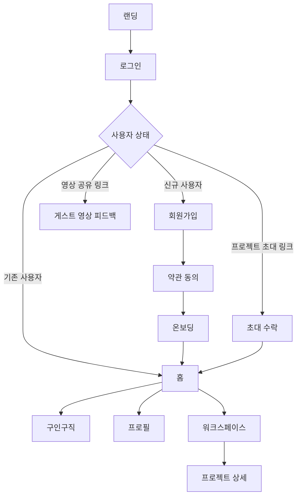

# SLATE-TO FE

> 영상 제작자를 위한 협업 워크스페이스 프론트엔드입니다.

## 기술 스택

| 구분         | 사용 기술                      |
| ------------ | ------------------------------ |
| Framework    | React 19, TypeScript 6, Vite 8 |
| Routing      | React Router                   |
| Server state | TanStack Query                 |
| Client state | Zustand                        |
| Styling      | Tailwind CSS 4                 |
| HTTP         | Axios                          |
| Validation   | Zod                            |
| Mock         | MSW 2                          |
| Date         | date-fns                       |
| Quality      | ESLint, Prettier               |
| Deploy       | Vercel                         |

정확한 버전은 [package.json](./package.json)을 기준으로 합니다.

## 주요 기능

- 이메일·Google 로그인 및 회원가입
- 약관 동의와 프로필 온보딩
- 프로젝트 생성·관리, 일정, 공지, 파일, 영상 피드백(답글 포함)
- 팀원 초대와 영상 공유 링크를 통한 게스트 피드백
- 구인구직 공고와 공개 프로필, 파일 첨부 지원
- 마이페이지와 계정 설정

## 화면 목록과 사용자 흐름

| 영역          | 화면                                                                          |
| ------------- | ----------------------------------------------------------------------------- |
| 진입          | 랜딩, 로그인, 이메일 회원가입, 약관 동의, 비밀번호 재설정, 프로젝트 초대 수락 |
| 온보딩        | 역할, 지역, 카테고리, 프로필 설정                                             |
| 홈            | 오늘의 브리핑, 프로젝트, 추천 공고, 미니 캘린더, 알림                         |
| 구인구직      | 공고 목록·작성·상세, 지원(파일 첨부), 지원자 확인                             |
| 프로필        | 마이 프로필, 공개 프로필, 북마크                                              |
| 워크스페이스  | 프로젝트 목록·설정, 공지, 최근 활동                                           |
| 프로젝트 상세 | 대시보드, 일정, 파일, 영상, 피드백과 답글                                     |
| 계정 설정     | 알림, 비밀번호 변경, 문의, 회원 탈퇴                                          |



## 폴더 구조

```text
src/
├── api/          # API client, endpoint paths, 요청·응답 변환
├── assets/       # 이미지, 아이콘, 폰트
├── components/   # 여러 도메인에서 쓰는 공용 UI
├── constants/    # 상태 라벨, 카테고리 등 상수
├── domains/      # 도메인별 UI와 기능 묶음
├── hooks/        # 공용 커스텀 훅
├── layouts/      # 공용 레이아웃
├── mocks/        # MSW browser worker와 handlers
├── pages/        # 페이지 단위 화면
├── queries/      # TanStack Query key, query, mutation
├── routes/       # React Router route 조각과 bridge
├── schemas/      # Zod schema
├── stores/       # Zustand store
├── styles/       # 공용 스타일 조합
├── types/        # 도메인 타입
└── utils/        # 순수 유틸리티
```

## 라우팅

앱은 `BrowserRouter`와 `Routes`를 사용합니다.

- 워크스페이스 경로는 `src/routes/workspace`에서 선언적으로 관리합니다.
- 전체 화면 진입 경로는 `src/routes/fullscreen`에서 관리합니다.
- 일부 기존 화면은 `App.tsx`의 레거시 분기와 `NavigateBridge`를 통해 React Router와 함께 동작합니다.
- 대부분의 페이지는 `React.lazy` + `Suspense`로 라우트 단위 code splitting이 적용되어 있습니다.

새 경로는 가능한 한 `routes/`에 추가하고, 기존 `navigate()` 헬퍼를 사용할 때에도 Router 상태와 URL 상태가 함께 갱신되는지 확인합니다.

## 로컬 실행

CI 기준 Node.js 버전은 20입니다.

```bash
npm ci
npm run dev
```

### 품질 확인

```bash
npm run lint
npm run format:check
npm run build
```

자동 포맷은 `npm run format`을 사용합니다.

## API·MSW 환경 설정

`.env.example`을 복사해 `.env.local`을 만들고 목적에 맞게 설정합니다.

| 목적              | `VITE_ENABLE_MSW` | `VITE_API_BASE_URL` | 설명                                                                 |
| ----------------- | ----------------- | ------------------- | -------------------------------------------------------------------- |
| 로컬 mock         | `true`            | 비움                | MSW가 `/api/v1` 요청을 가로챕니다.                                   |
| 로컬 BE proxy     | `false`           | 비움                | Vite dev server가 `/api`를 API 서버로 proxy합니다.                   |
| 원격 BE 직접 연결 | `false`           | API origin          | 브라우저가 API origin으로 직접 요청하므로 BE CORS 설정이 필요합니다. |

Vercel Preview·Production의 값은 저장소 파일이 아니라 Vercel 프로젝트 환경 변수에서 관리합니다. 실제 BE를 연결할 배포에서는 MSW를 끄고, 해당 배포 환경에 맞는 API base URL을 설정해야 합니다.

## 인증과 온보딩

- 실제 BE 모드에서 소셜 로그인은 인증 콜백 후 사용자 상태를 조회해 홈 또는 온보딩(신규 사용자는 약관 동의 포함)으로 이동합니다.
- 프로필 단계는 `POST /api/v1/users/onboarding`으로 닉네임, 역할, 지역, 카테고리, 소개, 약관 동의 값을 전송합니다.
- 프로필 이미지는 별도 업로드 흐름을 통해 처리한 뒤, 서버가 사용할 수 있는 URL만 온보딩 요청에 포함합니다.
- 프로젝트 초대 수락도 비슷한 구조로, 역할 선택 후 약관에 동의하면 초대를 수락합니다.
- MSW 모드에서는 위 흐름을 mock handler가 대체합니다.

## 스타일과 공용 폼 규약

폰트와 색상 토큰은 `src/index.css`의 `@theme`에서 관리합니다. 화면에서는 semantic color token을 우선 사용하고, 도메인 전용 스타일 조합은 `src/styles`에 둡니다.

**폰트**: Pretendard

| 구분         | 기준                                                                                                                  |
| ------------ | --------------------------------------------------------------------------------------------------------------------- |
| 타이포그래피 | `text-head-*`, `text-body-*`, `text-caption-*`과 굵기 클래스(`font-bold`/`font-semibold`/`font-normal`)를 조합합니다. |
| 색상         | Semantic token(`bg-primary`, `text-neutral-6` 등)을 우선 사용하고, 필요할 때만 primitive token을 직접 사용합니다.     |
| 공용 UI      | 여러 도메인에서 쓰는 UI는 `src/components`, 도메인 전용 UI는 `src/domains`에 둡니다.                                  |

> Input · TextArea · Select · Choice · Button 등 폼 컨트롤을 여러 명이 동시에 만들 때 props가 어긋나 폼 화면에서 충돌하는 것을 막기 위한 최소 규약입니다. 기준 템플릿은 `src/components/TextArea.tsx`.

폼 컴포넌트는 다음 역할을 구분합니다.

| 컴포넌트     | 용도                                                                                     |
| ------------ | ---------------------------------------------------------------------------------------- |
| `Input`      | 문자열 입력                                                                              |
| `TextArea`   | 여러 줄 텍스트 입력                                                                      |
| `FileInput`  | 파일 선택·업로드                                                                         |
| `Choice`     | checkbox·radio 선택                                                                      |
| `Select`     | 값 선택 드롭다운                                                                         |
| `Switch`     | boolean ON/OFF                                                                           |
| `ActionMenu` | 값 입력이 아닌 액션 목록 — 트리거 + `items[]` + 열림/닫기로 구성. 공통 props 규약 미적용 |

공용 폼 컴포넌트는 controlled props를 사용합니다.

| prop                 | 타입       | 동작                                                         |
| -------------------- | ---------- | ------------------------------------------------------------ |
| `label`              | `string?`  | 라벨. input `id`와 `htmlFor`로 연결 (`id` 미전달 시 `useId`) |
| `required`           | `boolean?` | `true`면 label 옆 `*` 표시 + input에 `aria-required`         |
| `hint`               | `string?`  | 안내 문구. `error`가 없을 때만 회색 표시                     |
| `error`              | `string?`  | 에러 메시지. 있으면 `hint`보다 우선, `text-warning` 색       |
| `value` / `onChange` | controlled | 값은 부모가 보유                                             |
| `disabled`           | `boolean?` | 비활성 상태                                                  |

```tsx
// 라벨 — input의 id와 htmlFor 연결, *는 필수 표시
{
  label && (
    <label htmlFor={id}>
      {label}
      {required && <span className="text-warning">*</span>}
    </label>
  )
}

// 메시지 — error가 hint보다 우선
{
  ;(error || hint) && (
    <span className={error ? 'text-warning' : 'text-neutral-5'}>{error ?? hint}</span>
  )
}
```

`variant`/`size`는 이름·값 종류만 통일하고 실제 Tailwind 매핑은 컴포넌트마다 자유입니다(`Button`의 `primary` ≠ `Tag`의 `primary` 생김새).

```ts
// src/types/ui.ts
export type Variant = 'primary' | 'secondary' | 'ghost'
export type Size = 'sm' | 'md' | 'lg'
```

이미 작업 중인 컴포넌트는 갈아엎지 않고 다음 작업분부터 적용합니다. 반대 의견은 PR 또는 팀 채널에 회신하고, 없으면 이대로 진행합니다.

### Zod 검증 흐름

- 스키마와 제출 검증은 페이지 또는 상위 도메인이 소유합니다.
- 공용 컴포넌트는 검증 규칙 대신 `error` 문자열을 받아 표시합니다.
- 필드별 검증은 필요할 때 `onBlur`와 `validateField`로 처리하고, 제출 시에는 전체 schema를 다시 검증합니다.
- 교차 필드 규칙은 base schema와 refine schema를 분리해, 필드 검증과 전체 제출 검증이 모두 가능하도록 합니다. `.refine()`이 붙은 스키마는 `.shape`가 없으므로, 필드별 검증을 위해 base 객체와 refine을 분리해야 합니다.

```ts
// src/schemas/...
const base = z.object({ password: /* ... */, passwordConfirm: /* ... */ })
export const signupSchema = base.refine((v) => v.password === v.passwordConfirm, {
  message: '비밀번호가 일치하지 않습니다',
  path: ['passwordConfirm'],
})
// 필드별 blur 검증 → base.shape.password (.shape 살아있음)
// 제출 검증        → signupSchema.safeParse(전체 값)
```

## API 응답과 캐시

- API endpoint와 응답 정규화는 `src/api`에서 관리합니다. BE 응답 형태가 도메인 모델과 다를 때는 `normalize.ts`, `scheduleNormalize.ts` 같은 변환 계층에서 맞춥니다.
- 서버 데이터는 `src/queries`의 query key, query, mutation으로 관리합니다.
- 변경 mutation 뒤에는 해당 화면뿐 아니라 영향을 받는 목록·상세 query를 함께 무효화합니다.

## 협업 규칙

### 브랜치

`dev`에서 작업 단위별 브랜치를 생성합니다.

```text
feature/{작성자}-{기능}
fix/{작성자}-{수정}
refactor/{작성자}-{대상}
docs/{작성자}-{문서}
```

### 이슈와 커밋

모든 변경은 먼저 GitHub 이슈로 기록합니다. 종류에 맞는 [이슈 템플릿](.github/ISSUE_TEMPLATE)을 사용합니다.

| 종류        | 템플릿 구성                                                                      |
| ----------- | -------------------------------------------------------------------------------- |
| 기능 개발   | 작업 내용 · 상세 작업(체크리스트) · 완료 조건(체크리스트) · 참고(피그마 링크 등) |
| 버그 리포트 | 재현 방법 · 예상/실제 동작 · 스크린샷 · 환경                                     |

라벨은 템플릿 선택 시 `enhancement`/`bug`가 자동으로 붙습니다. 리포지토리에 커스텀 `feature` 라벨은 없습니다.

커밋 제목에는 이슈 번호를 포함하고, 별도의 trailer는 사용하지 않습니다.

```text
type: 작업 내용 (#이슈번호)
```

예시:

```text
fix: 파일 업로드 제한을 수정 (#307)
```

| type       | 설명                                    |
| ---------- | --------------------------------------- |
| `feat`     | 새로운 기능                             |
| `fix`      | 버그 수정                               |
| `style`    | 코드 포맷, 세미콜론 등 (로직 변경 없음) |
| `refactor` | 리팩토링                                |
| `chore`    | 빌드 설정, 패키지 관리                  |
| `docs`     | 문서 수정                               |

### Pull Request

- 기능·화면·문서 등 검토 가능한 단위로 PR을 나눕니다.
- 일반 작업 PR의 base는 `dev`입니다.
- 제목은 커밋 규칙과 같은 `type: 작업 내용 (#이슈번호)` 형식으로 작성합니다.
- 본문은 [PR 템플릿](.github/PULL_REQUEST_TEMPLATE.md)에 맞춰 `Closes #이슈번호`, 변경 사항, 스크린샷, 리뷰 포인트, 체크리스트를 작성합니다. UI 변경이 있으면 스크린샷을 첨부하고, 문서-only PR은 «해당 없음»으로 표기합니다.
- 팀장 리뷰 후 머지합니다.
- `dev` 병합 뒤 통합 테스트를 진행하고, 배포 시점에만 `dev`를 `main`으로 병합합니다.

## 코드 작성 기준

| 대상                    | 규칙       | 예시                                    |
| ----------------------- | ---------- | --------------------------------------- |
| 컴포넌트 파일/폴더      | PascalCase | `VideoPlayer.tsx`                       |
| 함수 · 변수 · 커스텀 훅 | camelCase  | `isLoggedIn`, `useAuth.ts`              |
| 레포지토리 · 브랜치     | kebab-case | `slate-to-fe`, `feature/kcleverp-login` |

- 페이지는 라우팅·데이터 조립을 담당하고, 화면의 독립적인 상호작용은 도메인 컴포넌트 또는 훅으로 분리합니다.
- 사용하지 않는 상태·임시 데이터·디버깅 코드는 PR 전에 제거합니다.
- 비동기 요청의 로딩·오류·취소 또는 최신 요청 보장 방식을 명확히 처리합니다.
